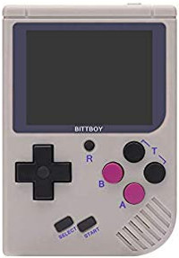
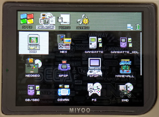
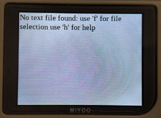
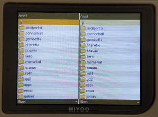
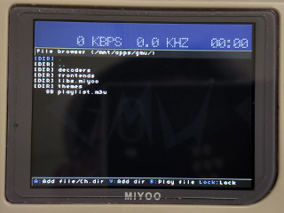
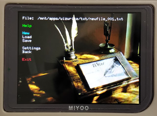
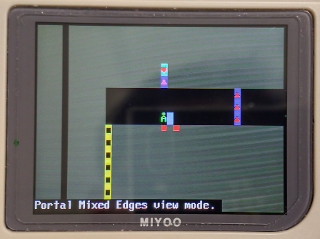
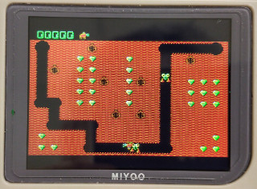
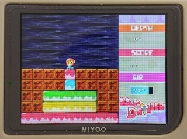
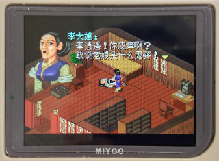

# OpenDingux for Miyoo/Bittboy Handheld

## Introduction
You might ask why I want to do this on Miyoo/Bittboy handheld ? Since stock firmware is Melis OS that is close-source for Allwinner SoC, the performance is not good as I expected and it is not easy to port some emulators to this OS because we cannot get more information on this OS unless reverse it. Of course, it is also lack of toolchain for developing some apps. So, if I can port Linux OS into this device, it will be more powerful as I think. Besides, we can also port more games and emulators into this device. Now, I finish most of tasks and it is time to share all of you, enjoy !  
  
If you would like to re-build all of sources, please refer to wiki page but you need to get toolchain, kernel and uboot in release page firstly before do it.
   
## Launcher
| Name | Picture |
|------|---------|
| GMenu2X |  |
   
## Applications
| Name | Picture | How to run it |
| -----|---------|---------------|
| Bard |  | 
| Commander |  |
| GMU |  |
| WizWrite |  |
   
## Emulators
| Name | Picture | How to run it |
| -----|---------|---------------|
| ASCIIpOrtal |  | 
| CCDoom | 
| CDogs | 
| Digger |  |
| FCEUX |
| GamBatte |
| GnGeo |
| GPSP |
| HHeretic |
| HHexen |
| JinYong |
| KOF |
| Liero |
| Mame4All |
| MrDrillux |  |
| OhBoy |
| OpenBOR |
| Pang |
| PCSX_ReARMed |
| PicoDrive | 
| ROTT |
| SDLPAL_v1 |  |
| SDLPAL_v2 |
| SMS |
| Snes9x4D |
| SORR |
| Temper |
| TombStone |
| Wolf3D |
| WQX |  |
   
## Website
-  https://steward-fu.github.io/website/index.htm

