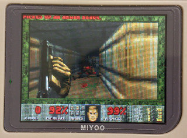
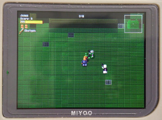
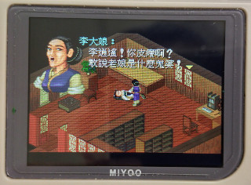

# OpenDingux for Miyoo/Bittboy Handheld

  
## Introduction
You might ask why I want to do this on Miyoo/Bittboy handheld ? Since stock firmware is Melis OS that is close-source for Allwinner SoC, the performance is not good as I expected and it is not easy to port some emulators to this OS because we cannot get more information on this OS unless reverse it. Of course, it is also lack of toolchain for developing some apps. So, if I can port Linux OS into this device, it will be more powerful as I think. Besides, we can also port more games and emulators into this device. Now, I finish most of tasks and it is time to share all of you, enjoy !  
  
If you would like to re-build all of sources, please refer to wiki page but you need to get toolchain, kernel and uboot in release page firstly before do it.
   
## Launcher
| Name | Picture |
|------|---------|
| GMenu2X |  |
   
## Applications
| Name | Picture | How to run | How to exit |
| -----|---------|------------|-------------|
| Bard |  | 1. set params in GMenu2X: -text $1  2. select text file | press SELECT |
| Commander |  | | press TB and select Quit |
| GMU |  | | press SELECT and then START |
| WizWrite |  | press MENU and select Exit |
   
## Emulators
| Name | Picture | How to run | How to exit |
| -----|---------|------------|-------------|
| ASCIIpOrtal |  | press MENU and select QUIT |
| CCDoom |  | 1. http://www.pc-freak.net/files/doom-wad-files  2. set params in GMenu2X: -iwad $1  3. select xxx.wad file | 
| CDogs |  | | press SELECT and then SELECT again |
| Digger |  | | press MENU |
| FCEUX |
| GamBatte |
| GnGeo |
| GPSP |
| HHeretic |
| HHexen |
| JinYong |
| KOF |
| Liero |
| Mame4All |
| Mr. Drillux |  | press SELECT |
| OhBoy |
| OpenBOR |
| Pang |
| PCSX_ReARMed |
| PicoDrive | 
| ROTT |
| SDLPAL_v1 |   劇情內容不一樣(簡體) | 於遊戲中按下B，選擇系統，再選擇結束遊戲 |
| SDLPAL_v2 |   劇情內容不一樣(繁體)  | 於遊戲中按下B，選擇系統，再選擇結束遊戲 |
| SMS |
| Snes9x4D |
| SORR |
| Temper |
| TombStone |
| Wolf3D |
| WQX |  | | move cursor to POW and press TA |
   
## Website
-  https://steward-fu.github.io/website/index.htm

